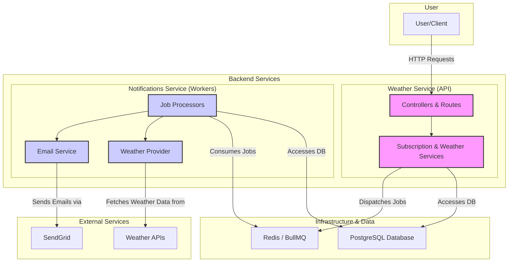

```mermaid
graph TD
    subgraph "User"
        A[User/Client]
    end

    subgraph "Backend Services"
        subgraph "Weather Service (API)"
            B[Controllers & Routes]
            C[Subscription & Weather Services]
            B --> C
        end

        subgraph "Notifications Service (Workers)"
            D[Job Processors]
            E[Email Service]
            F[Weather Provider]
            D --> E
            D --> F
        end
    end

    subgraph "Infrastructure & Data"
        G[Redis / BullMQ]
        H[PostgreSQL Database]
    end

    subgraph "External Services"
        I[SendGrid]
        J[Weather APIs]
    end

    A -- "HTTP Requests" --> B
    C -- "Dispatches Jobs" --> G
    C -- "Accesses DB" --> H
    D -- "Consumes Jobs" --> G
    D -- "Accesses DB" --> H
    E -- "Sends Emails via" --> I
    F -- "Fetches Weather Data from" --> J

    style B fill:#f9f,stroke:#333,stroke-width:2px
    style C fill:#f9f,stroke:#333,stroke-width:2px
    style D fill:#ccf,stroke:#333,stroke-width:2px
    style E fill:#ccf,stroke:#333,stroke-width:2px
    style F fill:#ccf,stroke:#333,stroke-width:2px

```
