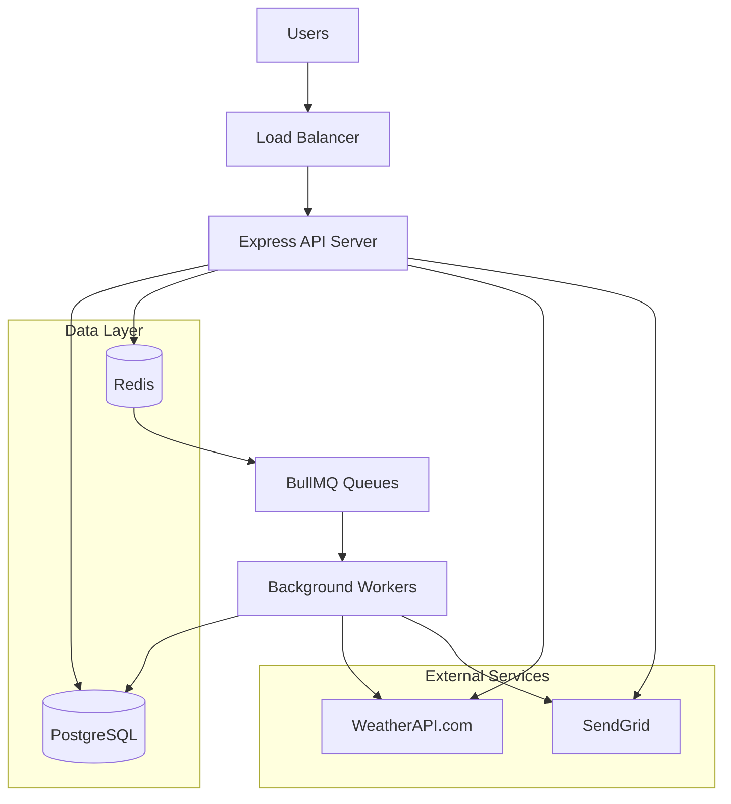
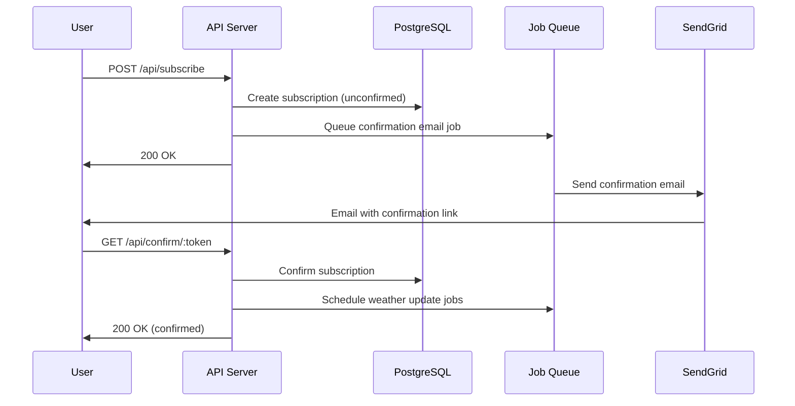
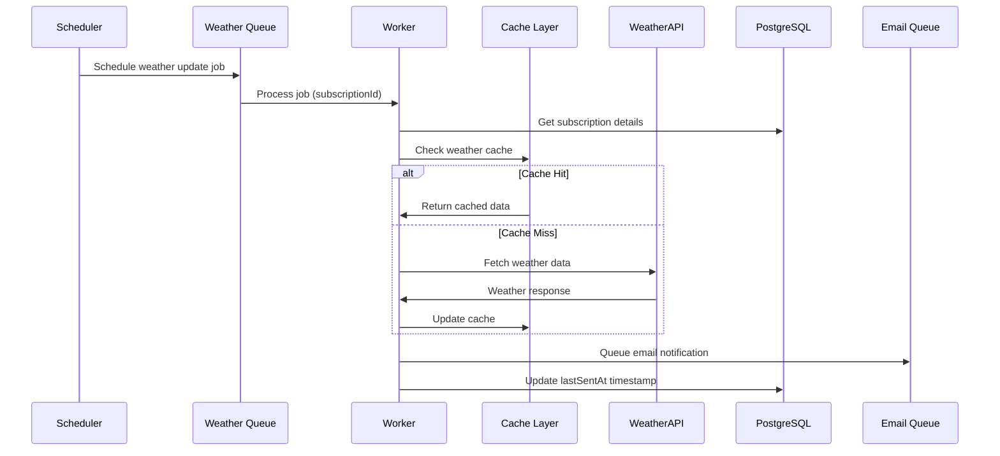

# Weather Subscription Service - System Design Document

## Table of Contents

1. [Application Requirements](#1-application-requirements)
2. [Load Estimation](#2-load-estimation)
3. [High-Level Architecture](#3-high-level-architecture)
4. [Detailed Component Design](#4-detailed-component-design)
5. [System Diagrams](#5-system-diagrams)

## 1. Application Requirements

### 1.1 Functional Requirements

- Users can subscribe/unsubscribe to weather updates for specific cities
- Users can choose notification frequency (hourly or daily)
- Users must confirm subscription via email
- System sends scheduled email notifications with weather information
- System caches weather data to reduce API calls
- Track email delivery status and failures

### 1.2 Non-Functional Requirements

**Performance:**

- API response time < 500ms for 95% of requests
- System can handle 10,000 concurrent users

**Reliability:**

- 99.9% uptime
- Automatic retry for failed operations

**Scalability:**

- Support 1 million active subscriptions
- Queue system can handle 100,000 jobs/hour

**Security:**

- All API inputs validated and sanitized
- Secure token generation for confirmations/unsubscribe

### 1.3 Constraints

- Free tier limitations of external APIs
- GDPR compliance for EU users
- Budget constraints for minimal infrastructure

## 2. Load Estimation

### 2.1 Users and Traffic

- **Active users**: 100,000
- **Estimated subscriptions per user**: 3-5
- **API requests**: 50 RPS
- **Background jobs**: 800,000 jobs/day

### 2.2 Data Estimation

**Database Storage:**

- **Subscriptions**: 200 bytes/record
- **Weather Cache**: 150 bytes/record
- **Email Logs**: 300 bytes/record
- **Total Database**: ~150 GB/year

**Redis Memory:**

- **Active jobs**: 500 bytes/record
- **Job history**: 500 bytes/record
- **Total Redis**: ~500MB/day

### 2.3 Bandwidth Estimation

- **Incoming**: 1Mbps
- **Outgoing**: 5Mbps
- **External API**: 20Mbps

## 3. High-Level Architecture



**Core Components:**

1. **API Layer**: Express.js REST API
2. **Database Layer**: PostgreSQL with Prisma ORM
3. **Cache/Queue Layer**: Redis with BullMQ
4. **External Integrations**: WeatherAPI.com, SendGrid

## 4. Detailed Component Design

### 4.1 API Service & Endpoints

**Responsibilities:**

- Handle API requests
- Validate and sanitize inputs
- Call business logic services
- Handle errors and logging

**REST API Endpoints:**

```typescript
// Subscription Management
POST /api/subscribe
GET  /api/confirm/:token
GET  /api/unsubscribe/:token

// Weather Data
GET  /api/weather?city={city}

// Health & Monitoring
GET  /health
```

### 4.2 Queue System Design

**Responsibilities:**

- Process background jobs
- Handle job scheduling, retries, failures, and dead letters

**Queue System:**

```
BullMQ Job System
├── Queues
│   ├── confirm_email_queue
│   ├── weather_update_queue
│   └── send_weather_update_email_queue
├── Job Types
│   ├── confirm_email
│   ├── update_weather_data
│   └── send_weather_update_email
├── Workers (with concurrency)
└── Schedulers (cron-based)
```

**Scheduling Strategy:**

- **Hourly**: `0 * * * *` (every hour)
- **Daily**: `0 8 * * *` (8 AM daily)

### 4.3 Weather API Integration & Caching

**Weather Service Architecture:**

```
WeatherService
├── External API Client (WeatherAPI.com)
├── Response Transformation
├── Error Handling & Retries
└── Rate Limiting
```

**Caching Strategy:**

```
PostgreSQL WeatherCache Table
├── Cache Duration: 30 minutes
├── City-based indexing
└── Fallback to API on cache miss
```

**Data Flow:**

1. Check cache for recent data (< 30 min)
2. Return cached data if available
3. Fetch from WeatherAPI.com if cache miss
4. Transform and validate response
5. Store in cache with timestamp
6. Return weather data

## 5. System Diagrams

### 5.1 Subscription Flow Sequence Diagram



### 5.2 Weather Update Process Diagram


